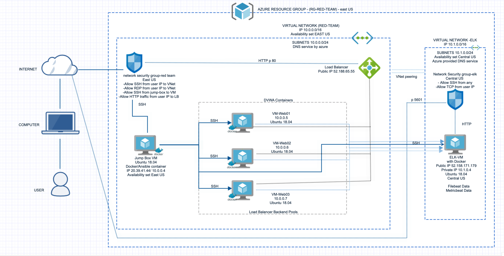
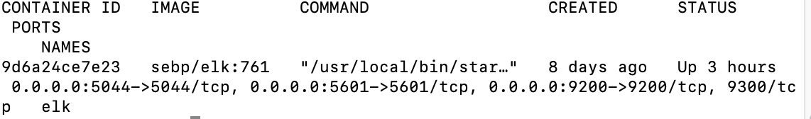
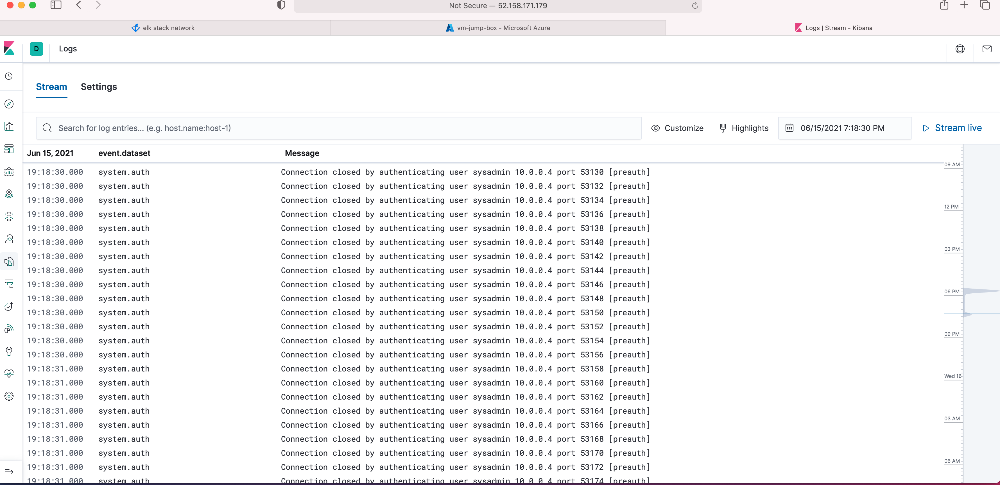
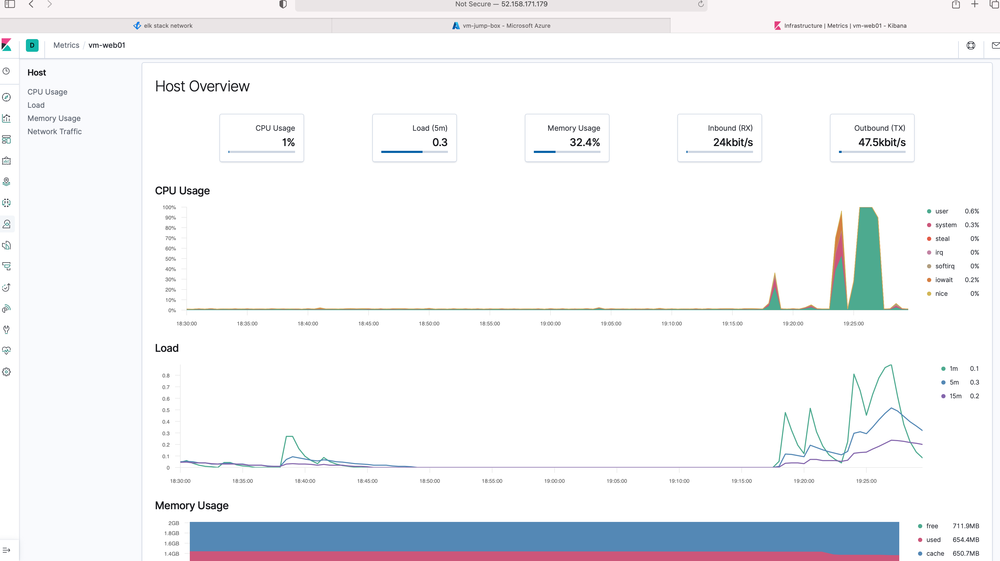

## Automated ELK Stack Deployment

The files in this repository were used to configure the network depicted below.

These files have been tested and used to generate a live ELK deployment on Azure. They can be used to either recreate the entire deployment pictured above. Alternatively, select portions of the configuration file may be used to install only certain pieces of it, such as Filebeat.

  - [Link](Filebeat/filebeat-playbook.yml)

This document contains the following details:
- Description of the Topology
- Access Policies
- ELK Configuration
  - Beats in Use
  - Machines Being Monitored
- How to Use the Ansible Build

### Description of the Topology

The main purpose of this network is to expose a load-balanced and monitored instance of DVWA, the D*mn Vulnerable Web Application.

Load balancing ensures that the application will be highly available, in addition to restricting inbound access to the network.
Load Balancers help in distributing inbound traffic to the 3 web servers and thus also protects against the Distributed Denial of Attack. The advantage of a jump box is that it is used to access and manage devices in separate zones and it can be hardened to limit access to various devices inside the zones. It is the point of contact from the public which helps to monitor the network more efficiently.

Integrating an ELK server allows users to easily monitor the vulnerable VMs for changes to the file system and system data.
Filebeat collects data about the file system like access logs, any suspicious changes made to the file, sudo escalation attempts.
Metricbeat collects data about the system like the cpu power, how long its been running, memory usage.

The configuration details of each machine may be found below.[Link](Config/webservers-config-playbook.yml)

| Name     | Function | IP Address | Operating System |
|----------|----------|------------|------------------|
| Jump Box | Gateway  | 10.0.0.4   | Linux            |
| VM-Web01 | webserver| 10.0.0.5   | Linux            |
| VM-Web01 | webserver| 10.0.0.6   | Linux            |
| VM-Web03 | webserver| 10.0.0.7   | Linux            |

### Access Policies

The machines on the internal network are not exposed to the public Internet. 

Only the Jump-Box machine can accept connections from the Internet. Access to this machine is only allowed from the following IP addresses:JumpboxpublicIP

Machines within the network can only be accessed by each other. 
The machines that send traffic to Elk server are VM-Web01, VM-Web02, VM-Web03. IP address JumpboxpublicIP has access to Elk through port 5601.

A summary of the access policies in place can be found in the table below.

| Name     | Publicly Accessible | Allowed IP Addresses |
|----------|---------------------|----------------------|
| Jump Box | Yes                 | JumpboxpublicIP      |
| Elk      | no                  | 10.1.0.1-254         |
| VM-Web01 | no                  | 10.0.0.1-254         |
| VM-Web02 | no                  | 10.0.0.1-254         |
| VM-Web03 | no                  | 10.0.0.1-254         |

### Elk Configuration

Ansible was used to automate configuration of the ELK machine. No configuration was performed manually, which is advantageous because it saves time from configuring every since machine one by one and also they are all configured the same way which prevents errors and bugs and the whole infrastructure can be written in an easy code which makes deployment and updates a breeze.

The playbook implements the following tasks on the Elkserver:[Link](Config/elkVM-config-playbook.yml)

- Installs Docker
- Installs python-pip3 and Docker python module
- Increases virtual memory using systemctl
- Downloads sebp/elk:761 image and launches the docker elk container

The following screenshot displays the result of running `docker ps` after successfully configuring the ELK instance.
 

### Target Machines & Beats
This ELK server is configured to monitor the following machines:

| Name      |   IP Address   |
| ----------|----------------|
| VM-Web01  |  10.0.0.5      |
| VM-Web02  |  10.0.0.6      |
| VM-Web03  |  10.0.0.7      |

We have installed the following Beats on these machines:
- Filebeat
- Metricbeat

These Beats allow us to collect the following information from each machine:
- Filebeat helps us to collect information of login, SSH and file system.
Image added of failed logins 

- Metricbeat provides information on the Cpu and its load. 

### Using the Playbook
In order to use the playbook, you will need to have an Ansible control node already configured. Assuming you have such a control node provisioned: 

SSH into the control node (Jump-Box) and follow the steps below:
- Copy the Playbook file to Ansible control node.
- Update the Hosts file to include the Elk server
- Run the playbook, and navigate to the Filebeat/metricbeat installation page of the Elk server GUI (Kibana) to check that the installation worked as expected.

This is filebeat and metricbeat playbook respectively 
- [Link](Filebeat/filebeat-playbook.yml) 
- [Link](Metricbeat/Metricbeat-playbook.yml)  
and it is copied into /etc/ansible.

The Ansible Hosts file is updated to include the Elk server IP address. [Link](Ansible/Ansible-hosts-config.cfg). Through the Playbook the filebeat and metricbeat are installed on the webservers.

By Navigating to http://52.158.171.179:5601/app/kibana we can see that the Elk server is running.

The following are the commands to run the playbooks. These playbooks are copied to the appropriate ansible control nodes and run.

'''
- cd /etc/ansible
- ansible-playbook filebeat-playbook.yml
- ansible-playbook Metricbeat-playbook.yml
- ansible-playbook elkVM-config-playbook.yml
- ansible-playbook webservers-config-playbook.yml'''

Using the command docker cp /home/azureuser/files cranky_euclid:/etc/ansible we can copy the playbook files into docker.

---
